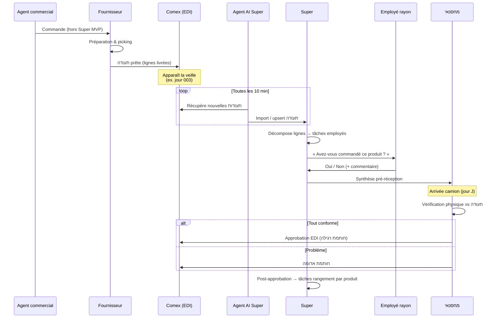
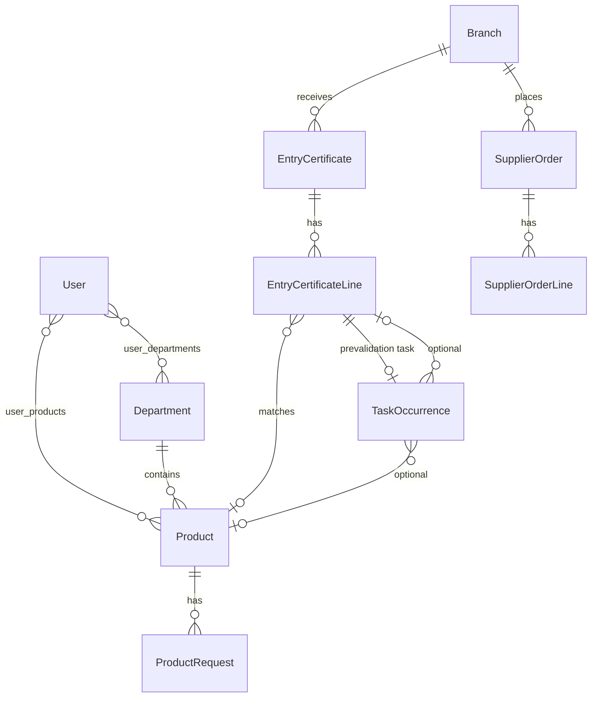

# Super — Produits, תעודות כניסה & flux opérationnels

> Spécification fonctionnelle et plan d'implémentation  
> Complément de `SPECIFICATION.md` — **aucun code dans ce document**  
> Date : juillet 2026

---

## 1. Contexte et objectifs

### 1.1 Problème métier (côté client)

Dans un supermarché israélien, la réception de marchandise repose sur un flux **Comex (קומקס) + EDI** :

1. Une **commande** est passée (agent commercial, application ou téléphone).
2. Le fournisseur **prépare et expédie** une **תעודת כניסה** (certificat d'entrée / bon de livraison) listant les produits effectivement livrés.
3. La תעודה est **transmise à Comex** la veille de la livraison prévue.
4. Le **מחסנאי** (magasinier) reçoit le camion, vérifie physiquement la marchandise, puis **approuve ou signale un problème** dans Comex.

**Point de friction principal — « לדחוף סחורה » (pousser de la marchandise)** :  
Les agents commerciaux ont un intérêt à ajouter des lignes non commandées. À l'arrivée du camion, le magasin ne se souvient plus toujours de ce qui a été commandé et approuve quand même — le magasin se retrouve avec des produits non désirés.

**Autre friction** : les **חותמות אדומות** (signatures rouges / litiges fournisseur) sont rarement posées en pratique, alors qu'elles permettent à la chaîne de récupérer 100–300 ₪ de crédit par incident.

### 1.2 Objectifs Super

| # | Objectif | Bénéfice attendu |
|---|----------|------------------|
| 1 | Anticiper la réception **avant l'arrivée du camion** | Le magasinier n'a plus à courir après les employés de rayon |
| 2 | **Pré-valider** chaque ligne produit avec l'employé concerné | Réduction du « poussage » de marchandise |
| 3 | Faciliter les **חותמות אדומות** | Plus de litiges documentés → crédits fournisseur |
| 4 | Accélérer l'**approbation EDI** par le magasinier | Gain de temps à la réception |
| 5 | Impliquer les **עובדים** (employés de rayon) dans leur périmètre produit | Meilleure responsabilisation |
| 6 | Enrichir chaque produit via une **fiche produit** (carte) | Base pour photos, certifications, demandes clients |
| 7 | Relier **demandes clients** et **commandes fournisseur** | Vision consolidée le jour de commande |

### 1.3 État actuel du codebase

| Élément | Statut |
|---------|--------|
| CRUD `Product` (nom, SKU, `department_id`) | ✅ Implémenté |
| CRUD `Department` (מחלקה) | ✅ Implémenté |
| Module `Task` (templates, occurrences, complétion média) | ✅ Implémenté |
| Lien tâche ↔ produit | ❌ Absent |
| Affectation employé ↔ département(s) N-N | ❌ Absent (prévu dans spec, pas en DB) |
| Affectation employé ↔ produit | ❌ Absent |
| תעודות כניסה / Comex / EDI | ❌ Absent |
| Fiche produit enrichie | ❌ Absent |
| Demandes clients / commandes | ❌ Absent |

Ce document décrit **ce qu'il faut construire** en s'appuyant sur l'architecture existante (Controller → Service → Repository, i18n `he.ts`, tests unitaires obligatoires).

---

## 2. Modèle de domaine — Produits et rattachements

### 2.1 Hiérarchie (inchangée)

```
Network (רשת)
 └── Branch (סניף)
      └── Department (מחלקה)
           └── Product (מוצר)
```

**Règle** : un produit appartient à **exactement une** מחלקה.  
La מחלקה détermine le **rayon** et, par défaut, les employés concernés.

### 2.2 Rattachements employé (nouveau)

Un **עובד** (`oved`, rôle `employee`) peut être lié :

| Relation | Cardinalité | Rôle |
|----------|-------------|------|
| Employé ↔ Département | **1 à N** (N-N) | Périmètre opérationnel : l'employé voit les tâches et produits de ses rayons |
| Employé ↔ Produit | **0 à 1** (optionnel) | Spécialisation : un employé « propriétaire » d'un produit précis (ex. fromager responsable d'un SKU) |

**Règles métier** :

- Un produit lié directement à un employé doit appartenir à une מחלקה **déjà assignée** à cet employé (validation domaine).
- Si aucun employé n'est lié au produit, la tâche est routée à **tous les employés** de la מחלקה du produit.
- Si plusieurs employés sont dans la même מחלקה et aucun n'est lié au produit → tâche assignée à la **מחלקה** (pattern existant `department_id` sur les tâches).
- Le **מחסנאי** (`warehouse_worker`) n'est pas rattaché aux produits ; il valide la תעודה globalement.

### 2.3 Extension du modèle Product

Champs actuels : `id`, `department_id`, `name`, `sku`, `is_active`.

**Extensions proposées pour la fiche produit** :

| Champ | Type | Description |
|-------|------|-------------|
| `barcode` | string | Code-barres EAN (optionnel) |
| `supplier_id` | FK | Fournisseur principal (V2 si module fournisseurs) |
| `image_url` | string | Photo produit (upload `/uploads/products/`) |
| `description` | text | Description libre |
| `certifications` | JSON / table liée | כשרויות (kasherout), bio, sans gluten, etc. |
| `metadata` | JSON | Champs extensibles (allergènes, température stockage…) |
| `created_from_entry_certificate_id` | FK nullable | Traçabilité : produit auto-créé depuis une תעודה |

---

## 3. Fiche produit (כרטיס מוצר)

### 3.1 Création automatique depuis une תעודת כניסה

Lorsqu'une תעודה contient un produit **inconnu** du référentiel (SKU / code fournisseur non trouvé) :

1. Super crée un **produit brouillon** (`is_active = false` ou statut `draft`).
2. Le produit est rattaché à la מחלקה déduite (mapping fournisseur → département, ou saisie manuelle par le manager).
3. Le manager / employé peut **compléter la fiche** : photo, certifications, nom hébreu définitif.

### 3.2 Enrichissement manuel

**Acteurs** : `branch_manager`, `network_manager`, employé du rayon (si autorisé).

**Actions** :
- Ajouter / modifier photo
- Saisir certifications (liste prédéfinie + texte libre)
- Corriger nom, SKU, code-barres
- Activer le produit (`is_active = true`)

### 3.3 Use cases — Fiche produit

| ID | Acteur | Scénario | Résultat |
|----|--------|----------|----------|
| PC-01 | Système | Ligne תעודה avec SKU inconnu | Création produit brouillon + notification manager |
| PC-02 | Manager | Ouvre fiche brouillon, ajoute photo et כשרות | Produit activé |
| PC-03 | Employé | Consulte fiche produit de son rayon | Voit infos + demandes clients en attente |
| PC-04 | Manager | Fusionne deux produits doublons | SKU unique, historique conservé |

---

## 4. תעודות כניסה — Certificats d'entrée

### 4.1 Vocabulaire

| Hébreu | Translittération | Entité Super |
|--------|------------------|--------------|
| תעודת כניסה | Teoudat Knissa | `EntryCertificate` |
| חותמת אדומה | Hotemet Aduma | `EntryCertificateDispute` / statut `red_stamp` |
| קומקס | Comex | Système externe (source EDI) |
| מחסנאי | Machsanai | Employé `warehouse_worker` |
| לדחוף סחורה | Ledahof Sakhora | Ligne non commandée (type litige) |

### 4.2 Flux métier complet



### 4.3 Entités proposées

#### `EntryCertificate` (תעודה)

| Champ | Description |
|-------|-------------|
| `id` | UUID |
| `branch_id` | Snif destinataire |
| `external_comex_id` | Identifiant Comex |
| `supplier_name` / `supplier_code` | Fournisseur |
| `expected_delivery_date` | Date livraison prévue (ex. jour 003) |
| `imported_at` | Horodatage import Super |
| `status` | Voir cycle de vie ci-dessous |
| `raw_payload` | JSON brut EDI (audit) |

#### `EntryCertificateLine` (ligne produit)

| Champ | Description |
|-------|-------------|
| `entry_certificate_id` | FK תעודה |
| `product_id` | FK nullable (matching SKU) |
| `supplier_product_code` | Code fournisseur |
| `product_name` | Libellé tel que sur la תעודה |
| `quantity` | Quantité livrée |
| `unit` | Unité (cartons, pièces…) |
| `order_reference` | Réf. commande d'origine (si disponible EDI) |
| `employee_prevalidation` | `pending` / `confirmed_ordered` / `not_ordered` |
| `employee_prevalidation_by_id` | FK employé |
| `employee_prevalidation_at` | Horodatage |
| `employee_comment` | Texte libre |
| `physical_check_status` | `pending` / `ok` / `missing` / `unexpected` |
| `dispute_type` | nullable : `not_ordered`, `not_delivered`, `quantity_mismatch` |

#### Cycle de vie `EntryCertificate.status`

```
imported → prevalidation_in_progress → ready_for_reception → received → approved | red_stamped
```

| Statut | Signification |
|--------|-------------|
| `imported` | Importée depuis Comex, tâches pas encore créées |
| `prevalidation_in_progress` | Employés en train de confirmer leurs lignes |
| `ready_for_reception` | Toutes pré-validations terminées (ou délai expiré) |
| `received` | Camion arrivé, magasinier en contrôle physique |
| `approved` | Approuvée dans Comex (חותמת רגילה) |
| `red_stamped` | Litige signalé (חותמת אדומה) |

### 4.4 Agent AI — Synchronisation Comex

**Rôle** : job planifié (cron / worker) exécuté **toutes les 10 minutes**.

**Comportement** :

1. Se connecte à Comex (API, scraping contrôlé, ou fichier EDI — **à définir avec le client**).
2. Liste les תעודות **nouvelles ou modifiées** pour les snifim du réseau.
3. Pour chaque תעודה :
   - Upsert `EntryCertificate` + lignes.
   - Match produits existants par SKU / code fournisseur.
   - Crée produits brouillon si inconnu.
   - Déclenche la **décomposition en tâches** (§ 4.5).
4. Journalise succès / erreurs (`integration_logs`).

**Note** : « imprimer » dans la demande client = **importer numériquement** dans Super, pas impression papier.

**Contraintes techniques** :

- Idempotence : ré-import d'une même תעודה ne duplique pas les lignes/tâches.
- Credentials Comex par réseau ou par snif (config sécurisée `.env` / table `integration_settings`).
- En cas d'échec Comex → retry avec backoff, alerte manager.

### 4.5 Décomposition lignes → tâches (משימות)

**Deux moments de décomposition** :

| Moment | Déclencheur | Objectif |
|--------|-------------|----------|
| **A — Pré-réception** | Import תעודה (avant camion) | Confirmer si le rayon a commandé chaque produit |
| **B — Post-approbation** | Magasinier approuve (רגילה ou אדומה) | Tâches opérationnelles : rangement, étiquetage, mise en rayon |

#### Moment A — Tâche de pré-validation

Pour **chaque ligne** de la תעודה :

```
Titre (he) : "אימות הזמנה — {nom produit}"
Description : "תעודת כניסה {numéro} — כמות {qty} — הגעה צפויה {date}"
Type : ad_hoc (ponctuel)
Assignation :
  1. employé lié au produit (si existe)
  2. sinon employés de la מחלקה du produit
  3. sinon tâche au niveau department_id
Échéance : veille de expected_delivery_date, 18:00 (configurable)
Actions employé :
  - « הזמנו » (confirmé commandé)
  - « לא הזמנו » (non commandé) → flag litige potentiel
  - Commentaire optionnel
```

**Notification au magasinier** : dès qu'un employé répond « לא הזמנו », le magasinier voit un indicateur 🔴 sur la ligne / la תעודה **avant** l'arrivée du camion.

#### Moment B — Tâches post-approbation

Après `approved` ou `red_stamped` :

```
Titre (he) : "קליטת מוצר — {nom produit}"
Description : quantité, emplacement suggéré
Assignation : même logique produit → employé → מחלקה
Type : ad_hoc
photo_required : true (optionnel, configurable par réseau)
```

**Lien avec module tâches existant** : ajouter `product_id` et `entry_certificate_line_id` (nullable) sur `TaskTemplate` / `TaskOccurrence`.

### 4.6 Interface magasinier (מחסנאי)

**Écran** : « תעודות כניסה » (route manager/warehouse)

**Vue principale** :
- Liste des תעודות par date de livraison
- Code couleur :
  - 🟢 Toutes lignes pré-validées « הזמנו »
  - 🟠 Pré-validation incomplète ou délai expiré
  - 🔴 Au moins une ligne « לא הזמנו » ou litige signalé

**Détail תעודה** :
- Tableau lignes : produit, qty, réponse employé, statut physique
- Synthèse : « X lignes OK · Y litiges »
- Actions :
  - Marquer réception camion (`received`)
  - Saisir contrôle physique ligne par ligne
  - **Approuver** → envoi EDI Comex (חותמת רגילה)
  - **חותמת אדומה** → sélection lignes litige + motif

**Aide à la חותמת אדומה** :
- Pré-remplir les litiges depuis les « לא הזמנו » employés
- Rappel des montants crédit estimés (100–300 ₪) — informatif
- Checklist avant validation : « Avez-vous vérifié toutes les lignes signalées ? »

### 4.7 Use cases — תעודות כניסה

| ID | Acteur | Scénario | Résultat |
|----|--------|----------|----------|
| EC-01 | Agent AI | Nouvelle תעודה dans Comex à 02:00 | Import + tâches pré-validation créées |
| EC-02 | Employé | Confirme « הזמנו » pour ses 5 lignes | Magasinier voit synthèse verte |
| EC-03 | Employé | Signale « לא הזמנו » sur 1 ligne | Magasinier alerté 🔴 avant camion |
| EC-04 | Magasinier | Camion arrive, produit manquant | `physical_check_status = missing`, prépare חותמת אדומה |
| EC-05 | Magasinier | Produit non commandé présent | Confirme litige, חותמת אדומה vers Comex |
| EC-06 | Magasinier | Tout OK | Approbation EDI, tâches rangement créées |
| EC-07 | Manager | Consulte historique תעודות du mois | Reporting litiges / crédits |
| EC-08 | Système | SKU inconnu sur תעודה | Produit brouillon + tâche pré-validation quand même |

---

## 5. Demandes clients & commandes fournisseur

### 5.1 Contexte

En dehors du flux תעודה, le client souhaite :

1. Enregistrer les **demandes clients** pour un produit (client X veut Y).
2. Enregistrer les **besoins de réappro** (rupture, stock bas).
3. Le **jour de commande**, l'employé voit la **consolidation** : ce que les clients ont demandé + commandes spéciales.

### 5.2 Entités proposées

#### `ProductRequest` (demande)

| Champ | Description |
|-------|-------------|
| `product_id` | FK produit |
| `branch_id` | Snif |
| `request_type` | `customer_order` / `restock` / `special_order` |
| `quantity` | Quantité demandée |
| `customer_name` | nullable (si commande client) |
| `customer_phone` | nullable |
| `notes` | Texte libre |
| `requested_by_id` | Employé ou manager |
| `status` | `open` / `included_in_order` / `fulfilled` / `cancelled` |
| `needed_by_date` | Date souhaitée |

#### `SupplierOrder` (commande fournisseur — V1 simplifiée)

| Champ | Description |
|-------|-------------|
| `branch_id` | Snif |
| `order_date` | Date de passage commande |
| `status` | `draft` / `submitted` / `closed` |
| Lignes | `product_id`, `quantity`, lien vers `ProductRequest`(s) |

### 5.3 Fiche produit — panneau demandes

Sur la **כרטיס מוצר**, onglet « בקשות » :

- Liste des demandes ouvertes (`status = open`)
- Bouton « הוסף בקשה » (employé / manager)
- Indicateur : total quantités en attente

### 5.4 Jour de commande — vue employé

**Écran** : « יום הזמנה » (accessible aux employés de rayon + manager)

**Contenu** :
- Filtré par **מחלקות** de l'employé
- Pour chaque produit :
  - Stock actuel (V2 — si module stock)
  - Demandes clients ouvertes (nom client, qty)
  - Commandes spéciales
  - Suggestion qty à commander (somme demandes + marge — règle configurable)
- L'employé saisit la **quantité à commander** par produit
- Le manager valide et exporte / soumet (intégration fournisseur — hors scope MVP)

### 5.5 Use cases — Demandes & commandes

| ID | Acteur | Scénario | Résultat |
|----|--------|----------|----------|
| OR-01 | Employé | Client demande 2 kg pommes | `ProductRequest` créée sur fiche produit |
| OR-02 | Employé | Rupture sur produit X | Demande `restock` |
| OR-03 | Employé | Ouvre « יום הזמנה » vendredi | Voit consolidation par produit |
| OR-04 | Employé | Saisit quantités commande | Brouillon `SupplierOrder` |
| OR-05 | Manager | Valide et clôture commande | Demandes passent à `included_in_order` |
| OR-06 | Système | תעודה reçue avec produit commandé | Demande client passe à `fulfilled` (V2) |

---

## 6. Permissions et rôles

| Action | admin | network_manager | branch_manager | warehouse_worker | employee |
|--------|-------|-----------------|----------------|------------------|----------|
| CRUD produits référentiel | ✅ | ✅ | ✅ (son snif) | ❌ | ❌ |
| Enrichir fiche produit | ✅ | ✅ | ✅ | ❌ | ✅ (son rayon) |
| Assigner employé ↔ מחלקה | ✅ | ✅ | ✅ | ❌ | ❌ |
| Assigner employé ↔ produit | ✅ | ✅ | ✅ | ❌ | ❌ |
| Voir תעודות כניסה | ✅ | ✅ | ✅ | ✅ | ❌ (sauf ses lignes) |
| Pré-valider ligne תעודה | ❌ | ❌ | ❌ | ❌ | ✅ (si sa ligne) |
| Approuver / חותמת אדומה | ❌ | ✅ | ✅ | ✅ | ❌ |
| Créer demande client | ✅ | ✅ | ✅ | ❌ | ✅ |
| Jour de commande | ✅ | ✅ | ✅ | ❌ | ✅ |

**Périmètre API** : réutiliser `domain/scope.py` — filtrage par `network_id`, `branch_id`, `department_ids[]` de l'utilisateur.

---

## 7. Architecture technique — Plan d'implémentation

### 7.1 Principes

- Respecter la séparation **Controller → Service → Repository → Domain**.
- Pas de SQL dans les controllers.
- Règles métier (matching produit, routage tâches, validation litiges) dans `domain/`.
- UI 100 % hébreu via `i18n/he.ts`.
- Tests unitaires obligatoires (services + domain).

### 7.2 Phases proposées

#### Phase 1 — Fondations produits & affectations

**Backend**
- Migration : `user_departments` (N-N), `user_products` (optionnel 1-N)
- Extension `Product` (barcode, image, certifications, metadata)
- `UserService` : gestion affectations
- `ProductService` : enrichissement fiche

**Frontend**
- Fiche produit (manager) : onglets infos / certifications / photo
- Écran affectation employés ↔ מחלקות (ManagerEmployeesPage)

**Tests**
- Validation : produit hors מחלקה employé → erreur
- Routage : résolution employé cible pour un produit

#### Phase 2 — תעודות כניסה (cœur métier)

**Backend**
- Module `entry_certificates/` :
  - `EntryCertificateService`, `EntryCertificateRepository`
  - `EntryCertificateController` → `/api/entry-certificates`
- Extension tâches : `product_id`, `entry_certificate_line_id`, `task_purpose` (`prevalidation` / `intake`)
- `EntryCertificateTaskService` : décomposition lignes → occurrences
- Webhook ou polling endpoint pour l'agent AI

**Frontend**
- Page magasinier : liste + détail תעודות
- Vue employé : tâches pré-validation (intégration EmployeeTasksPage)
- Notifications SSE (pattern existant)

**Intégration**
- `integrations/comex/` : client, parser EDI, config
- Job `scripts/sync_comex_entry_certificates.py` (cron 10 min)

**Tests**
- Import idempotent
- Décomposition 3 lignes → 3 tâches aux bons employés
- Ligne « לא הזמנו » → flag litige visible magasinier

#### Phase 3 — Approbation EDI & post-traitement

**Backend**
- `EntryCertificateApprovalService` : envoi Comex (mock en dev)
- Transition statuts + création tâches rangement
- `EntryCertificateDispute` : motifs, lignes, montant estimé

**Frontend**
- Flow חותמת אדומה (dialog confirmation)
- Historique litiges

**Tests**
- Approbation → tâches post-réception
- חותמת אדומה → statut + payload EDI dispute

#### Phase 4 — Demandes clients & jour de commande

**Backend**
- `ProductRequestService`, `SupplierOrderService`
- Endpoints consolidation « יום הזמנה »

**Frontend**
- Onglet demandes sur fiche produit
- Page « יום הזמנה »

**Tests**
- Consolidation multi-demandes
- Permissions employé par מחלקה

### 7.3 Nouveaux fichiers (structure cible)

```
backend/app/
├── models/
│   ├── entry_certificate.py
│   ├── entry_certificate_line.py
│   ├── product_request.py
│   └── user_department.py
├── domain/
│   ├── entry_certificate_rules.py   # matching, litiges, statuts
│   ├── product_routing.py           # employé cible pour un produit
│   └── order_consolidation.py
├── services/
│   ├── entry_certificate_service.py
│   ├── entry_certificate_task_service.py
│   ├── product_request_service.py
│   └── user_department_service.py
├── repositories/
│   ├── entry_certificate_repository.py
│   └── product_request_repository.py
├── controllers/
│   ├── entry_certificate_controller.py
│   └── product_request_controller.py
├── integrations/
│   └── comex/
│       ├── client.py
│       ├── parser.py
│       └── sync_job.py
└── tests/
    ├── services/test_entry_certificate_service.py
    ├── services/test_product_routing.py
    └── domain/test_entry_certificate_rules.py

frontend/src/
├── pages/
│   ├── manager/
│   │   ├── ManagerEntryCertificatesPage.tsx
│   │   ├── ManagerProductCardPage.tsx
│   │   └── ManagerOrderDayPage.tsx
│   └── employee/
│       └── EmployeeOrderDayPage.tsx
├── services/
│   ├── entryCertificateService.ts
│   └── productRequestService.ts
└── components/
    ├── entryCertificates/
    └── products/
```

### 7.4 API endpoints (ébauche)

| Méthode | Route | Description |
|---------|-------|-------------|
| GET | `/api/products/{id}/card` | Fiche produit enrichie |
| PATCH | `/api/products/{id}/card` | Mise à jour photo, certifications |
| PUT | `/api/users/{id}/departments` | Affectation מחלקות |
| PUT | `/api/users/{id}/products` | Affectation produits |
| GET | `/api/entry-certificates` | Liste תעודות (filtres date, statut) |
| GET | `/api/entry-certificates/{id}` | Détail + lignes |
| POST | `/api/entry-certificates/sync` | Déclenchement manuel sync Comex |
| POST | `/api/entry-certificates/{id}/lines/{line_id}/prevalidate` | Réponse employé |
| POST | `/api/entry-certificates/{id}/receive` | Marquer camion reçu |
| POST | `/api/entry-certificates/{id}/approve` | Approbation EDI |
| POST | `/api/entry-certificates/{id}/red-stamp` | חותמת אדומה |
| GET/POST | `/api/products/{id}/requests` | Demandes client |
| GET | `/api/order-day/summary` | Consolidation jour de commande |
| POST | `/api/supplier-orders` | Créer / soumettre commande |

### 7.5 Temps réel & notifications

Réutiliser le **SSE existant** (`/api/events`) :

| Événement | Destinataire |
|-----------|--------------|
| `entry_certificate.imported` | Magasinier, manager snif |
| `entry_certificate.line_disputed` | Magasinier |
| `entry_certificate.ready_for_reception` | Magasinier |
| `task.prevalidation_assigned` | Employé concerné |
| `product.draft_created` | Manager snif |

---

## 8. Modèle de données — Extensions



### Tables nouvelles

| Table | Description |
|-------|-------------|
| `user_departments` | N-N user ↔ department |
| `user_products` | N-N user ↔ product (optionnel) |
| `product_certifications` | Liste normalisée ou JSON sur products |
| `entry_certificates` | תעודות |
| `entry_certificate_lines` | Lignes produit |
| `entry_certificate_disputes` | Litiges חותמת אדומה |
| `integration_logs` | Journal sync Comex |
| `product_requests` | Demandes clients / réappro |
| `supplier_orders` | Commandes fournisseur |
| `supplier_order_lines` | Lignes commande |

### Enums nouveaux

```python
class EntryCertificateStatus(str, Enum):
    IMPORTED = "imported"
    PREVALIDATION_IN_PROGRESS = "prevalidation_in_progress"
    READY_FOR_RECEPTION = "ready_for_reception"
    RECEIVED = "received"
    APPROVED = "approved"
    RED_STAMPED = "red_stamped"

class EmployeePrevalidation(str, Enum):
    PENDING = "pending"
    CONFIRMED_ORDERED = "confirmed_ordered"
    NOT_ORDERED = "not_ordered"

class TaskPurpose(str, Enum):
    GENERAL = "general"           # existant
    EC_PREVALIDATION = "ec_prevalidation"
    EC_INTAKE = "ec_intake"

class ProductRequestType(str, Enum):
    CUSTOMER_ORDER = "customer_order"
    RESTOCK = "restock"
    SPECIAL_ORDER = "special_order"
```

---

## 9. Points ouverts / décisions client

| # | Question | Impact |
|---|----------|--------|
| 1 | **Format d'accès Comex** : API officielle, EDI fichier, ou scraping ? | Architecture intégration |
| 2 | **Matching produit** : SKU interne, code fournisseur, les deux ? | Import תעודות |
| 3 | **Délai pré-validation** : que se passe-t-il si l'employé ne répond pas ? | Passage auto à `ready_for_reception` avec flag orange |
| 4 | **Commande d'origine** : Super stocke-t-il les commandes passées aux fournisseurs (pour comparer à la תעודה) ? | Détection « לדחוף סחורה » automatique vs manuelle |
| 5 | **Module stock** : nécessaire pour « יום הזמנה » ou seulement les demandes ? | Phase 4 scope |
| 6 | **Crédit חותמת אדומה** : tracking montant récupéré ou simple statistique ? | Reporting |
| 7 | **Multi-employés par produit** : 1 seul ou plusieurs responsables ? | Table `user_products` |

---

## 10. Critères d'acceptation (Definition of Done)

### Global

- [ ] Architecture modulaire respectée (controller / service / repository)
- [ ] UI entièrement en hébreu (`he.ts`)
- [ ] Tests unitaires backend (pytest) : cas nominal + permission + cas limite
- [ ] Tests frontend (Vitest) : hooks/services critiques
- [ ] Périmètre rôle appliqué sur toutes les routes

### תעודות כניסה (MVP)

- [ ] Sync Comex toutes les 10 min (ou mock configurable)
- [ ] Chaque ligne תעודה génère une tâche pré-validation assignée au bon employé
- [ ] Magasinier voit synthèse avant arrivée camion
- [ ] Réponse « לא הזמנו » visible comme alerte
- [ ] Approbation / חותמת אדומה met à jour statut + crée tâches rangement
- [ ] Produit inconnu → fiche brouillon

### Fiche produit

- [ ] Photo + certifications éditables
- [ ] Traçabilité création depuis תעודה

### Demandes & commandes

- [ ] CRUD demandes sur fiche produit
- [ ] Vue « יום הזמנה » consolidée par מחלקה employé

---

## 11. Références codebase existant

| Sujet | Fichier |
|-------|---------|
| Modèle Product actuel | `backend/app/models/product.py` |
| CRUD produits | `backend/app/services/product_service.py` |
| Tâches & affectation department | `backend/app/models/task_template.py` |
| Scope permissions | `backend/app/domain/scope.py`, `task_scope.py` |
| UI produits admin | `frontend/src/pages/admin/AdminProductsPage.tsx` |
| i18n | `frontend/src/i18n/he.ts` |
| Spec générale | `SPECIFICATION.md` |
| Architecture modules | `.cursor/rules/module-architecture.mdc` |

---

## 12. Glossaire FR ↔ HE ↔ Code

| Français | Hébreu | Code |
|----------|--------|------|
| Certificat d'entrée | תעודת כניסה | `EntryCertificate` |
| Signature rouge | חותמת אדומה | `red_stamped` / dispute |
| Département / rayon | מחלקה | `Department` |
| Produit | מוצר | `Product` |
| Employé | עובד | `employee` (rôle `oved`) |
| Magasinier | מחסנאי | `warehouse_worker` |
| Tâche | משימה | `TaskOccurrence` |
| Pousser marchandise | לדחוף סחורה | litige `not_ordered` |
| Jour de commande | יום הזמנה | `OrderDay` |
| Demande client | בקשת לקוח | `ProductRequest` |
| Fiche produit | כרטיס מוצר | Product card |
| Comex | קומקס | intégration externe |
